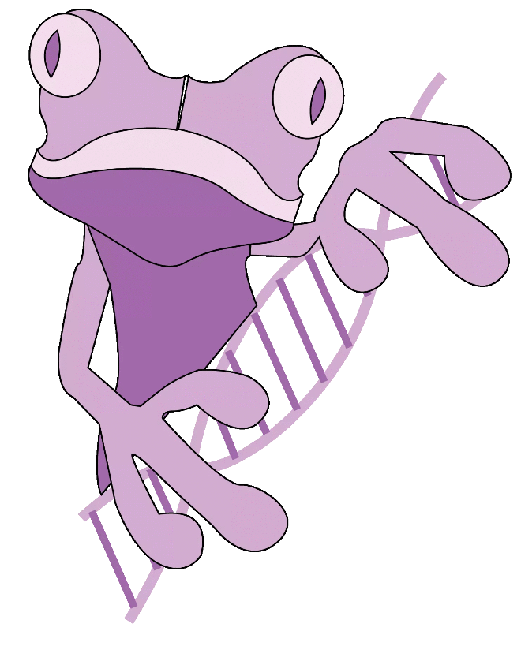

Hey ! My name is Vranckx Anne-Charlotte. I am a student in Biology (BAB2). If you arrived by chance, nice to meet you : You arrived in my universe. 
This blog is a project that I have to realize during my University year ... and more. The first goal is to improve my scientific English by writing scientific articles and my informatic skills by using RStudio. I think this project is very cool and I want to explore all of this opportunity. 

Let me introduce my logo... ho I mean my frog. Her name is Astrée. She is very nice and like me, she is passionate by molecular biology and the aquatic world. She wants to know more about DNA (that's why she always takes hers with her). We both like pink as you can see her color and the theme of my blog ... You understand, we are made for each other.

I am very curious to know your feedback about my project. I hope you will enjoy reading my articles and so on. 

**Scientific blog - Anne-Charlotte Vranckx (student) - Miss Bouchet (English teacher) - Mister Grosjean (SDD teacher) - 2020 - 2021.**

