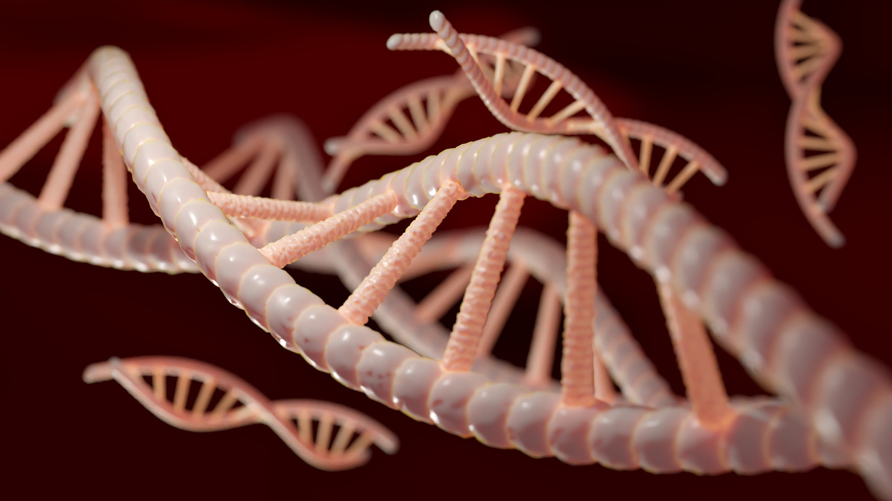

```{r, echo = FALSE, eval = FALSE}
#distill::create_post("my post") # use this fonction to create a new post
```
# Welcome !



I am very happy to welcome you on my blog. This universe is a concentrate of science, scientific news, data science and much more!
You will find interesting sections in the header : 

- An "**English for Science**" section that collects a selection of analyses of scientific articles on **The Impact of Microorganisms on Metazoans**. You can also find a multitude of articles related to my English course. All these publications will be exclusively in English.
- A "**Data Science**" section that gathers a multitude of works. These works allow me to better understand the use of RStudio and data processing. These works will allow me to be better trained for my future job: researcher. The publications in this section will be in French and English.
- A "**Science by me**" section which will be content that I will find interesting to share with you. It will go from comments on an interesting article, to go further in one of the subjects of my courses, ...
